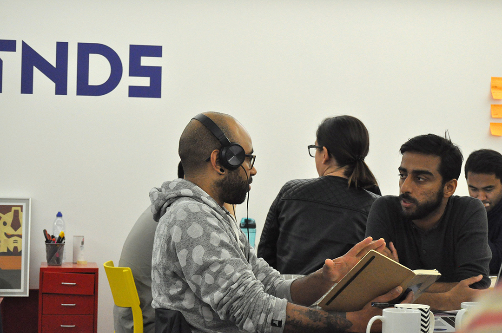
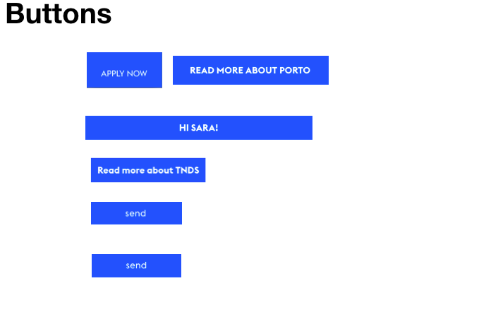
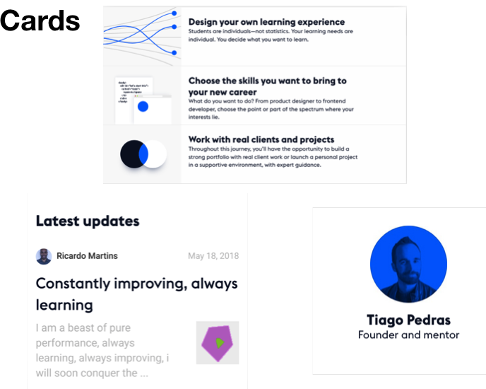
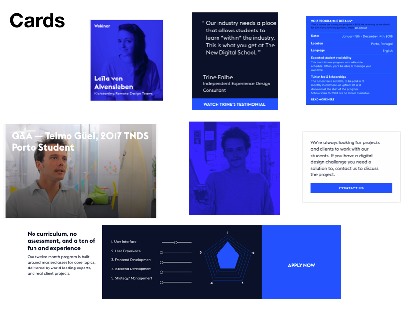
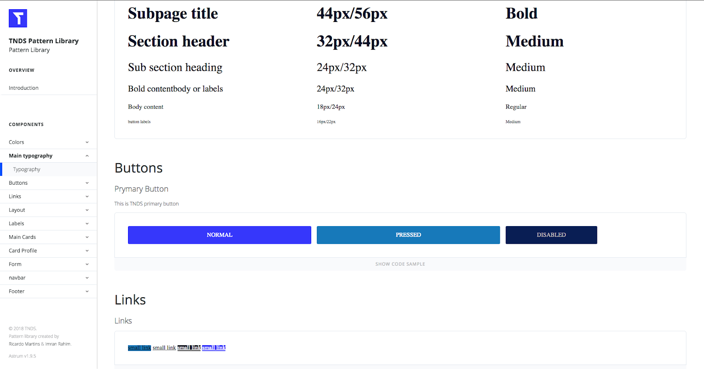

This project started during the masterclass with Javier ‘Simón’ Cuello at The New Digital School . Javier is a UX designer specializing in mobile, currently living in Barcelona, who has worked on app design projects for companies like Zara, Telefónica, and Yahoo and is also the co-author of Designing Mobile Apps.

##The challenge

As students at a school as alternative as The New Digital School (TNDS), it’s important for us to track our progress and set goals to define each one’s right path. For that purpose, we have Polygon, a platform for planning and assessing of our learning process at the school.
Me and Imran Rahim decided to work on Polygon because it didn’t have a mobile version at the time. We also wanted to make some improvements on the way it worked.
We also felt it was important to work on a real problem while developing our design and development skills. Working on this project could have an immediate impact for all students.

##Process

Between the masterclass and the challenge week, we came across more dilemmas. Already considering starting a design system, we needed to decide how we would split tasks so that it would be easy to work remotely. Globally we identified three distinct stages:

- Design the mobile app version (Android) for the Polygon (part of the initial masterclass challenge);
- Flow changes to have a better user experience;
- Readapt the mobile app design that emerged from the masterclass to the current web version and all its constraints;
- Start a Pattern Library;

We sketched our app in paper wireframes and with the help of Marvel app we were able to test the prototype in order to find potential challenges.

That allowed us to start increasing fidelity of wireframes based on Material design. Material design was what we use a starting point. With the goal of keeping consistency, we also learned that is very important for sticking with pattern interactions that users are used to. This avoids confusion and keeps the same user experience between operating systems.

We went through some versions until reach a better user experience.

With Polygon actually being a web platform, we had to start looking at it as a web app and adjust the design accordingly. The good thing about Material design is the fact that it’s universal when it comes to the environment of the app and can also be used for the web.

As TNDS grows and creates more web projects, it needs a place where it’s visual patterns are documented and accessible by designers and developers (including students). With this in mind, we decided it was worth it to explore the idea of creating a Pattern Library.

##The Pattern Library

A pattern library consists of a collection of reusable Interface elements organized in a way that allows developers to see their visual look, behavior, and code.

For TNDS, this collection of elements has the purpose of keep consistency allowing the creation of elements that appear multiple times making it easier to reuse them in future projects.

We started by identifying some patterns such as Typography, buttons, cards, navbar, forms, and labels.

Fig 1. Buttons from interface inventory

Fig 2. UI card components collected from the website and mobile app prototype

image

Fig 3.UI card components collected from the website and mobile app prototype

I knew there were tools to help you avoid building a pattern library from scratch and I found a few like Atomic and Astrum and proceeded to test both. Astrum was the chosen one because it’s lightweight, easy to include in projects and because it offers a command-line to manage components and groups. Astrum is also responsive and I loved how easy it was to customize the theme.

image

Fig 4. Pattern library overview

With style sheets getting larger and harder to maintain, CSS preprocessors like Sass help by keeping style sheets concise and allowing to modularize the code while offering a set of features not yet available in regular CSS.

Learning a new tool takes time and finding the time to do so is sometimes very hard. This project was an opportunity for me to practice my Sass skills.
While working with Astrum I realized the number of concepts I would be able to learn and try. By doing that I covered methodologies like Atomic Design, Block Element Modifier (BEM) and, implemented preprocessors like Sass and technologies like CSS grid.

##Takeaways
Plan before doing

We spent a considerable amount of time planning ahead. This helped to avoid frustration at the end of the project.

Another good thing about having planned enough before starting was that I had the chance to develop other skills like decision making, collaboration, communication.
Communication and Collaboration are essential

The best way to collaborate as a team is to always involve each other in the tasks and testing/adjusting things as we go.

We knew upfront that we set a lot of expectations for ONE week and finding the right tools and methodologies was key for efficiency, collaboration, and motivation. So to make everything work smoothly, communication between us was essential, particularly considering we were working remotely.
Atomic Design, complex but powerful

I understood the value and the potential of having a design system and a pattern library. Above all, I learned a lot not only by being involved with these two concepts but especially with technologies and methodologies we used during this process.
Full experience -> UX, UI, Development

We started this project in the context of a UI Masterclass but we ended up doing much more.

- I developed my UX Design skills by researching and trying to empathize with users.
- User testing was very important to refine the app, validate our assumptions and improve the user flow. Marvel App was a valuable tool that allowed us to test our low fidelity prototypes.
- With Javier I learned about the importance of designing with interface components in mind, and how Figma and Sketch can be powerful allies in different scenarios.
- Finally, the Pattern Library allowed me to evolve as a Frontend developer while allowing me to review and apply important methodologies and technologies, such as BEM, Sass, CSS Grid.

##Resources

[BEM](http://getbem.com/)

[Atomic Design](http://bradfrost.com/blog/post/atomic-web-design/)

[Smashing Magazine “Taking The Pattern Library To The Next Level“ by Vitaly Friedman](https://www.smashingmagazine.com/taking-pattern-libraries-next-level/)

[fmmricardo-Twitter](https://twitter.com/FMMRicardo)

[fmmRicardo-Github](https://github.com/fmmricardo)

[Imran](https://twitter.com/imran_rahim_pt)
